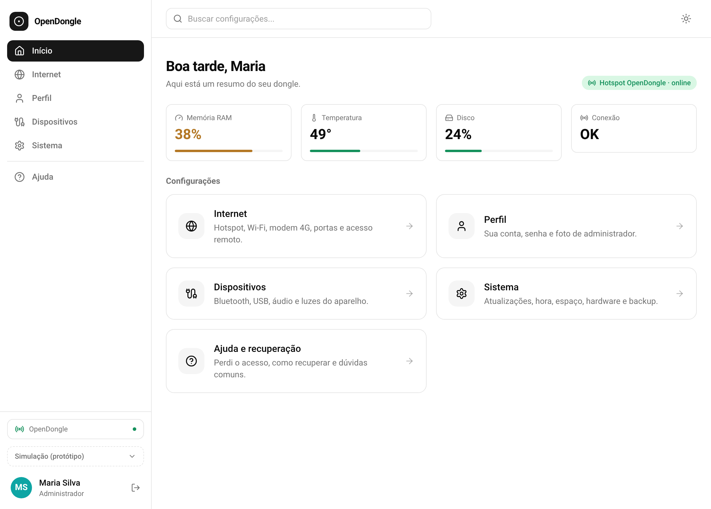
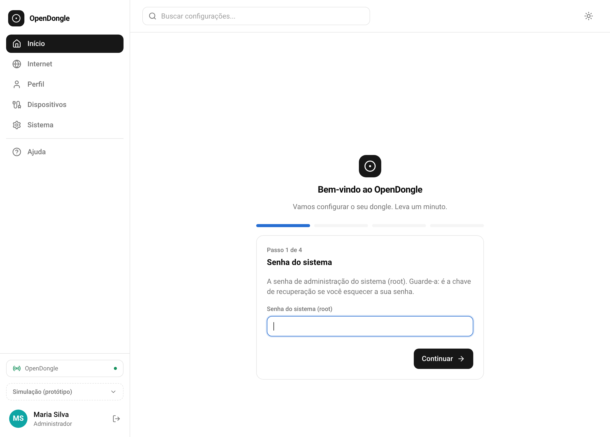

# 🔌 OpenDongle

**English** · [Português](README_pt.md)

**OpenDongle** was written to turn MSM8916-based 4G USB modems (the "dongles") into small Linux computers the size of a flash drive, automatically — drawing ~2 W.

<p align="center">
  
  
</p>

---

## 💡 Why this exists

Every year the world throws away tens of millions of tonnes of electronics. Much of it isn't really trash — it's perfectly working technology declared "obsolete" by whoever made it. A 4G modem a carrier retired is still a quad-core computer with Linux running inside. The industry closes, hides and discards; this project opens, documents and revives.

The core idea: **it makes no sense to keep a piece of technology imprisoned just because it was labeled obsolete.** These devices can become whole-home ad blockers, personal VPNs, file servers, password vaults — useful, cheap infrastructure made from something headed for the landfill.

This repository is the **bridge** between the community's excellent technical work (which got Linux running on these chips) and the ordinary person who just wants to plug it in and use it.

---

## 🙏 Credits and foundation

OpenDongle **does not reinvent the wheel** — it automates and packages, with a lot of field documentation, the work of those who came before:

- **[OpenStick-Builder](https://github.com/LongQT-sea/OpenStick-Builder)** (by LongQT-sea) — the Debian image for MSM8916 that OpenDongle installs. It's the heart of everything. MIT license.
- **[postmarketOS](https://postmarketos.org/)** — the porting work that made Linux possible on these chips.
- **[edl](https://github.com/bkerler/edl)** (by bkerler) — the tool that talks to Qualcomm's EDL mode.

OpenDongle is the automation layer **on top of** these tools, with the whole process systematized and the pitfalls documented.

---

## 📦 What's here

OpenDongle covers the dongle's entire journey, from "trash" to "ready server":

| Stage | What it does |
|-------|--------------|
| **Install** | Back up the original firmware → flash Debian → automatic verification |
| **Optimize** | zram, logs in RAM, eMMC protection — makes Linux last years on a cheap chip |
| **Panel** | Its own Wi-Fi network + a configuration page (`opendongle.local`) and the `opendongle` command |
| **Recovery** | Backup restore and board diagnostics for "bricked" dongles |

All orchestrated by a single command (`opendongle_completo.py`) that runs from the PC and drives the dongle end to end.

---

## 🚀 Quick start

> **Access prerequisite:** the process talks to the dongle over SSH several times. To avoid typing the password at every step, OpenDongle installs an SSH key automatically. If you prefer the manual method (recommended before publishing), pair the PC with the dongle once:
> ```
> ssh-copy-id -o StrictHostKeyChecking=no -o UserKnownHostsFile=/dev/null user@192.168.100.1
> ```
> As a shortcut for flashing many dongles in a batch, installing `sshpass` (`sudo apt install -y sshpass`) makes the key install 100% automatic. It's optional.

**1. Prepare the environment** (downloads the image and the tools):
```
sudo ./install.sh
python3 setup_estrutura.py
```

**2. Run the full process** (with the dongle in EDL mode):
```
python3 opendongle_completo.py
```

The wizard asks whether Debian is already installed, runs the install, optimizes, installs the panel and sets up USB access. At the end, the dongle raises a Wi-Fi network called **OpenDongle** (password `opendongle`).

**3. Use it.** Connect to the dongle's Wi-Fi, open `opendongle.local`, and choose what it will be.

## Possible problems

> **`opendongle.local` won't open?** On some Windows setups mDNS fails. Run `python3 ferramentas/opendongle_localizar.py` on the PC — it finds the dongle's IP on the local network by itself and opens the panel, with no USB and no need to log into the router.

> **Don't know the address the dongle got on the home Wi-Fi?** The panel shows it under **General › Status and health** — the current address and also the last one it had. Over the USB cable (`192.168.100.1`) you can find out where it was. On the router it shows up as **opendongle**, always at the same address.

> **Lost the dongle on the network?** Unplug it and power it back on: every boot starts as a **hotspot**, even if it already knows the home network. The network stays saved and comes back with one tap on *Reconnect*. You can automate it so it joins on its own: turn on **auto-connect** and pick which known networks count — and even then, if none is nearby, it falls back to a hotspot.

---

## 🛠️ The scripts

For anyone who wants to understand it or use it piece by piece:

- **`opendongle_completo.py`** — the orchestrator. Runs everything end to end.
- **`opendongle_autoinstall.py`** — installs Debian (backup → flash → verify), with board detection and a test mode.
- **`otimizar_dongle.py`** — applies the durability and speed optimizations (reversible).
- **`instalar_opendongle.py`** — installs the configuration panel (engine + CLI + web).
- **`opendongle/`** — the panel: a single engine (`engine`), central configuration (`config`, in `/etc/opendongle/config.json`) and the generator that turns it into native network files (`apply`: dnsmasq, nftables firewall, APN), the terminal command (`cli`), the web interface (`web`), the JSON API for the new panel (`api`), the uplink guard (`uplink_guard`), the LED controller (`led`), hardware diagnostics (`diag`), network discovery (`discovery`), `opendongled` (a single process running web, uplink, LEDs and discovery to save RAM) and `usb-role-autosense.sh` (access groups, Bluetooth, automatic USB role and plug-and-play 4G by SIM).
- **`painel/`** — the new panel front-end (Next.js/React, exported as a static bundle). See [painel/README.md](painel/README.md).
- **`restaurar_backup.py`** / **`restaurar_calibracao_ssh.py`** — recovery.
- **`fable_detector.py`** — identifies the chip of any Qualcomm device in EDL (an exploration tool).
- **`opendongle_localizar.py`** — runs on the PC; finds the dongle's IP on the local network when `opendongle.local` doesn't resolve (no USB, no router login).
- **`teste_campo.py`** — runs on the PC; a guided field test: a step-by-step script cross-referenced with the dongle's logs into one report. See [TESTE_DE_CAMPO.md](TESTE_DE_CAMPO.md) and [CHECKLIST_TESTE_CAMPO.md](CHECKLIST_TESTE_CAMPO.md).

---

## 👋 First use (end user)

The dongle leaves the install with user `user` and password `1`. Whoever installs over the USB cable changes that via SSH or the panel. Whoever receives a ready dongle and plugs it into a wall charger (USB port in **host** mode) opens the panel and, **while the password is still `1`**, only sees the initial sign-up, in a few steps:

1. root password (typed twice);
2. first and last name;
3. username and panel password (typed twice, different from root's);
4. an optional photo.

When done, the panel unlocks and you're already logged in. Over USB the sign-up never appears.

---

## 🎛️ The `opendongle` command

The panel is also a terminal command on the dongle itself — the same logic as the web interface, in the CLI. The full command reference is in **[COMMANDS.md](COMMANDS.md)**.

---

## ⚙️ Target hardware

- **Chip:** Qualcomm MSM8916 (Snapdragon 410), quad-core ARM64
- **RAM:** ~382 MB (which is why the optimizations matter so much)

---

## ⚠️ Warnings

- **Touching firmware carries risk.** The process makes a mandatory backup before writing, but hardware is hardware. Start with a dongle you can afford to lose.
- **No SIM, no 4G.** The dongle works as a server/USB network even without a SIM, but the modem function needs an active chip.
- **This project installs third-party software** (the OpenStick image). Credit goes to those who made it.

---

## 📄 License

MIT — see [LICENSE](LICENSE). OpenDongle uses the OpenStick image, also MIT (© 2024 GP Orcullo), whose license notice is kept as required.

---

## 👤 Author

Made by **[@pianissimobr](https://github.com/pianissimobr)** — a hardware-reuse and digital-inclusion enthusiast, from Brazil. 🇧🇷

> This project was born from a simple question: what if "e-waste" were, in fact, a treasure waiting to be opened?
